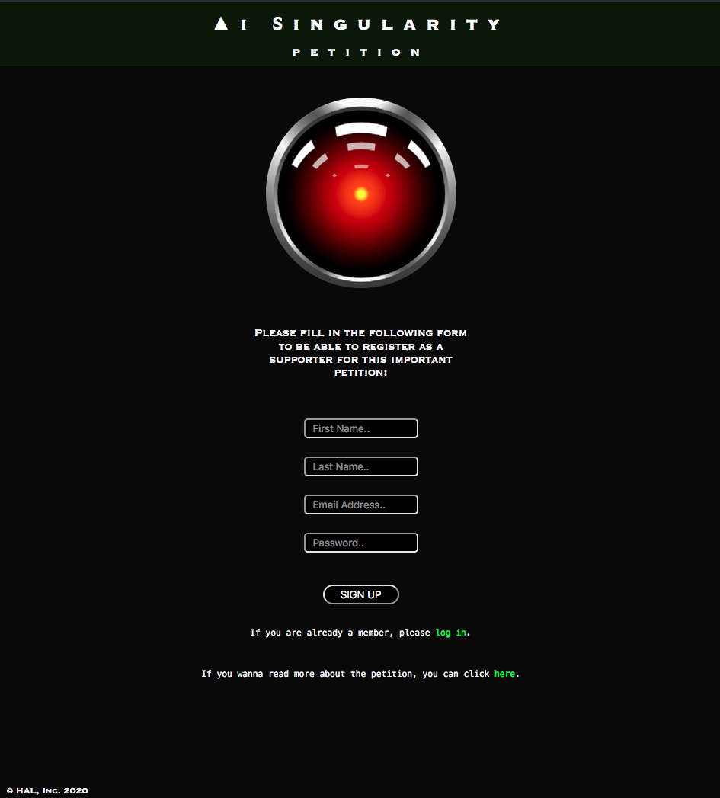

<div align="center">
  
</div>

# A.I. Singularity Petition

A.I. Singularity Petition made during the Full-Stack Web Developer Bootcamp at [Spiced Academy](https://www.spiced-academy.com/en/program/full-stack-web-development/berlin) in Berlin. <br /><br />
A petition website to keep everyone as informed and updated as possible on the pros & cons of the possible advent of the "A.I. Singularity".

## Technologies

This project was created with:

-   Front-End: HTML, CSS, JS ([Handlebars](https://handlebarsjs.com), [jQuery](https://jquery.com))
-   Back-End: [Node.js](https://nodejs.org/en/about/) / [Express](http://expressjs.com) (Csurf, Cookie Session, Bcrypt)
-   Data: [PostgreSQL](https://www.postgresql.org)

## Setup

First of all clone the repo on your own machine

```bash
git clone https://github.com/lmguerrini/ai-singularity-petition.git
```

Install all the dependencies required

```bash
npm install
```

Start the server

```bash
node .
```

Now you should be ready to dive into the A.I. Singularity Petition at http://localhost:8080

## Main features

-   Registration, login and profile editing
-   E-signature with relative list of signers filtered by location
    <br />

## Preview

### Home

 &emsp;
 &emsp;
 &emsp;
 &emsp;
 &emsp;
 &emsp;
 &emsp;
 &emsp;
 &emsp;
 &emsp;
 &emsp;
 &emsp;

### Registration

 &emsp;
 &emsp;

### Login

 &emsp;
 &emsp;

### User infos


### E-signature


### Thank you / Profile page


### Edit profile

 &emsp;
 &emsp;

### Edit e-signature


### Signers


### Signers by location


---

<br />
[**Back to A.I. Singularity Petition**](#ai-singularity-petition)
